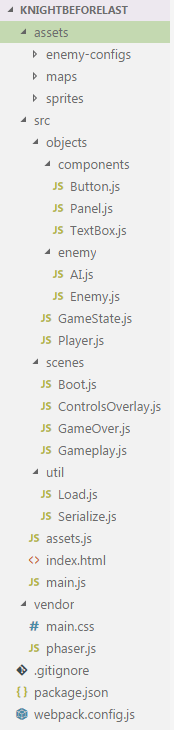

# Phaser 3 Series: Dev 102 (part 1)

Most of the tutorials I've seen on Phaser are super focused on teaching one
new skill or feature. If you already have a strong development background
this is great as it cuts out all the unimportant details and gets you working
with whatever functionality you're after.

For many learning as you go this approach leaves your game a collection of
code taken from tutorials that roughly cover your desired feature haphazardly
slapped together. In the beginning this approach seems easy as each copy/paste
update means a quick win and new feature.  But a game is complex and as your
codebase grows:

- it becomes harder to remember what a specific of section of code does
- the places that need to be updated as you add features are hard to find
- every new change means a increases the chance of bugs.

To help combat these things this tutorial focuses how to structure your project
and then touches on a few principles to help encourage good development
practices.

## Structure

The most obvious level up you can take from the "hello Phaser" guides is
getting your code out of one file. This is a huge improvement but, like most
organization techniques, if you do it without a system in mind it quickly just
becomes a different kind of chaos.

To that end I generally start with four major locations:

#### `root/`
This is the project's root directy. It'll mostly just contain configuration
files for any of the tools I'm using as part of the project

#### `root/vendor/`
This contains any static code that I pull in and that isn't available through
`npm` (or your package repo of choice) or that I reference directly from my
HTML test page. In my projects this is almost always just a custom build of
Phaser and a pretty boring CSS file.

#### `root/assets/`
A game is composed of more than just code. All of that other stuff gets
collected into this directory. Audio, spritesheets, level information etc.

#### `root/src/`
This is where all the magic (and tears) happen.

My games generally start with code divided into sections based on its
functionality within the project. For Phaser games that means I start with:

- `src/objects/` &mdash; a section for entities that will exist in my game
- `src/components/` &mdash; a collection of UI elements that I'll use to
  display information or interact with the player
- `src/scenes/` &mdash; one file per scene that my game contains
- `src/util` &mdash; functions that aren't particularly tied to gameplay goes
  into my util collection.

Having a consistent approach to identifying where some code or asset should
live doesn't magically improve your code. Bugs still happen and code is still
messy but it does remove some of the load of navigating your codebase.
