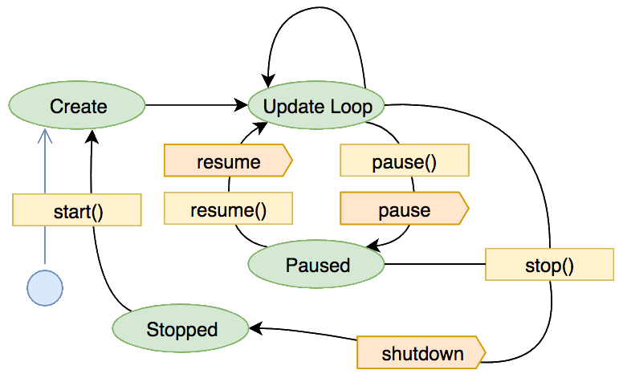
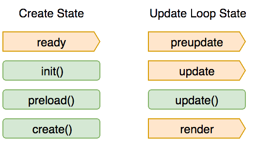

# Phaser 3 Series: Let's Talk About Scenes

Let's talk about [`Scene`][sceneref]. If you're coming from Phaser 2 it's easy to
mistake a [`this`](https://developer.mozilla.org/en-US/docs/Web/JavaScript/Reference/Operators/this) for the older `State` object. 

If you're just thinking about the definition of the word it's easy to view them as a linear sequence of things that
flow into each other but are generally independent. 

Both of these comparisons are
partially correct but they're also a very limited view and can lead to missing a
powerful tool in the battle against complicated code.

This guide is a crash course into what they are, how they work, how to use
them, and where to learn more. 

I assume a moderate degree of comfort with
both Javascript and Phaser itself. If you haven't worked through a basic
"build your first game" tutorial I would suggest reading [this][guide1] or
[this][guide2] before diving in here.

[This][guide3] is also a very interested tutorial, although the architecture is a bit more complex.

[sceneref]: https://photonstorm.github.io/phaser3-docs/Phaser.Scene.html
[guide1]: https://gamedevacademy.org/phaser-3-tutorial/
[guide2]: https://phaser.io/tutorials/making-your-first-phaser-3-game
[guide3]: https://github.com/DoctaCloak/phaser-pet


## What is a `Scene`

A `Scene` in your game is a collection of [`GameObject`][gameobject]s and
related logic which should be kept together. 

The objects will be drawn when the
scene is rendered and its `update` method will get called on every tick of your
game loop, which is roughly 60 times a second.


[gameobject]: https://photonstorm.github.io/phaser3-docs/Phaser.GameObjects.GameObject.html

Where they get special is that Phaser 3 doesn't place any constraints on how
many need to be running. This means you can have 0, 1, or as many as you need
going at once. You can communicate between them and each scene has a z-index
so you can make statements like: "My UI Scene will _always_ be rendered above
the play Scene which is _always_ above the background Scene."

## How do they work

A `Scene` is just a class that extends `Phaser.Scene` and contains a `create`
method. The Phaser framework has a system that manages all the `Scene`s it
knows about, tracks which are currently active, maintains the correct layering,
and tells each to update and render when it should.

A super basic scene that logs to the console when its lifecycle methods are
called would be defined like so:

```javascript
class SimpleScene extends Phaser.Scene {
  constructor() {
    super({ key: 'SimpleScene' })
  }

  init() {
    console.log('SimpleScene#init')
  }

  preload() {
    console.log('SimpleScene#preload')
  }

  create() {
    console.log('SimpleScene#create')
  }

  update() {
    console.log('SimpleScene#update')
  }
}
```

One thing that a `Scene` does not expose is a function to be called during the
render step. This is an explicit decision in the framework and it means that we
need to rely on the managing the Scene's display list to put things on the
screen. There are signals emitted before and after the render call if you need
to take action there but we won't dig into them in this doc.

### Lifecycle

Now that we've hinted at the scene lifecycle lets talk in a bit more detail
what that looks like. A simplified model is that it moves between four states:
_Create_, _Update Loop_, _Paused_, and _Stopped_. Most transitions are initiated
by a function call and emit a signal that can be listened for if you need to
take actions at specific points in tho process.

In the following state diagram functions which initiate a transition  are in
light yellow and signals emitted are light orange.

<center></center>

Additionally the _Create_ and _Update Loop_ states emit several signals and
will call functions if your scene defines them (as we did in the code sample
above). Emitted signals are light orange and the functions you can define are
light green:

<center></center>

One potentially surprising behavior is that once a scene has been shut down it
is not garbage collected but, rather, can be resumed via `start()`. When this
happens the three creation functions get called once more. This means any state
tracked in the scene class will be retained between a stopped state and the
next create state. As a result special care must be taken to set a known
initial value on everything requiring one.

### Scene Management a.k.a. Making Things Happen

#### Important attributes

Making a `Scene` dance requires knowing where its control points are. This is
pretty well documented in [the API docs][scene-docs] but it's probably still
worth calling out where a few important things live. These attribute paths
begin with a `this` reference on the assumption your code is in a Scene method.
If that is not the case it can be subtituted with any variable of type
`Phaser.Scene` (or a child of it).

| Attribute          | What is it | Docs |
| ---------          | ---------- | ---- |
| `this.scene`       | A reference to the `ScenePlugin` object. Contains a bunch of useful methods for managing scene state, layering, etc. | [link][sp-doc] |
| `this.load`        | Access to the `LoaderPlugin` which can be used to queue fetching of external assets. Typically used in `preload` but can be used outside of it with additional work. | [link][lp-doc] |
| `this.add`         | Using `GameObjectFactory` it's trivial to create one of the basic Phaser objects, associate it with this scene, and add it to the display list. | [link][gof-doc] |
| `this.physics.add` | Similar to `.add`, `.physics.add` is used to construct (Arcade) physics enabled variants of a game object and associate it with this scene. Matter and Impact physics systems have similar factories as well. | [link][apf-doc] |
| `this.anims`       | The globally shared animation manager; used to create or retrieve animations that can be applied to a sprite. | [link][am-doc] |
| `this.events`      | This is the `EventEmitter` associated with this scene, use it to listen for or publish events. | [link][ee-doc] |
| `this.sys`         | A catch-all location for plugins and other scene-related behavior. | [link][sys-doc] |

[ee-doc]: https://photonstorm.github.io/phaser3-docs/Phaser.Events.EventEmitter.html
[sys-doc]: https://photonstorm.github.io/phaser3-docs/Phaser.Scenes.Systems.html
[sp-doc]: https://photonstorm.github.io/phaser3-docs/Phaser.Scenes.ScenePlugin.html
[lp-doc]: https://photonstorm.github.io/phaser3-docs/Phaser.Loader.LoaderPlugin.html
[gof-doc]: https://photonstorm.github.io/phaser3-docs/Phaser.GameObjects.GameObjectFactory.html
[apf-doc]: https://photonstorm.github.io/phaser3-docs/Phaser.Physics.Arcade.ArcadePhysics.html#add
[am-doc]: https://photonstorm.github.io/phaser3-docs/Phaser.Animations.AnimationManager.html
[scene-docs]: https://photonstorm.github.io/phaser3-docs/Phaser.Scene.html

#### Displaying objects

Let's start with the easy stuff. I mentioned that getting things to be drawn
as part of a scene is done by adding things to the display list. This is
handled automatically if using a factory associated with the scene, e.g.,
[`scene.add`][scene-add] or [`scene.physics.add`][scene-physics-add]. Keep
in mind that you can also use factories to add [existing][scene-existing-add]
[objects][arcade-existing-add] as well creating new objects and adding them
at the same time.

[scene-add]: https://photonstorm.github.io/phaser3-docs/Phaser.Scene.html#add
[scene-physics-add]: https://photonstorm.github.io/phaser3-docs/Phaser.Physics.Arcade.ArcadePhysics.html#add
[scene-existing-add]: https://photonstorm.github.io/phaser3-docs/Phaser.GameObjects.GameObjectFactory.html#existing
[arcade-existing-add]: https://photonstorm.github.io/phaser3-docs/Phaser.Physics.Arcade.Factory.html#existing

#### Adding/Removing Scenes

The easist approach is just to add all your scenes in the initial set that get
passed into the Game constructor:

```javascript
new Phaser.Game({
  ...,
  scenes: [ Scene1, Scene2, Scene3 ],
})
```

By default the first scene in that list will run. You can control this behavior
by passing the `autorun` config attribute to the `Phaser.Scene` constructor.

However, sometimes that doesn't work and you need to add a scene at a later
point in. If that's the case you can call [ScenePlugin#add][sp-add] which make
the new scene available to use in your game.

If you're done with a scene and need to clean it up for memory conservation
(or any other reason) you can destroy it with [ScenePlugin#remove][sp-remove].

[sp-add]: https://photonstorm.github.io/phaser3-docs/Phaser.Scenes.ScenePlugin.html#add
[sp-remove]: https://photonstorm.github.io/phaser3-docs/Phaser.Scenes.ScenePlugin.html#remove

#### Switching States

Now that you have scenes available to work with the main question is how to
control them.

_-> Create_:

The key methods here are `ScenePlugin` methods [start][sp-start] and
[launch][sp-launch]. Both of these will trigger a scene to move into the
_Create_ state. `start` additionally moves the current scene into _Stopped_
whereas `launch` does not impact the currently running scene. (Note: in this
case "current" references the scene that is the parent of the `ScenePlugin`
used to start/launch a new scene.)

When calling either of these methods data may be passed in which will be made
available to your scene's `init` and `create` functions. An example of this in
use follows:

```javascript
class GamePlay extends Phaser.Scene {
  constructor(ctorData) {
    super({ key: 'GamePlay' })
  }

  init(startData) {
    if (startData.newGame) {
      // set up new game data structures
    } else {
      // load save
    }

    // kick off the UI overlay
    this.scene.launch('GameUI')
  }

  create(startData) {
    this.loadPlayer(startData.player)
  }
}

// In Menu scene

create() {
  startGameButton.on('pointerdown', function() {
    this.scene.start('GamePlay', {
      newGame: this.newGame.value(),
      saveSlot: this.saveSlot.value(),
      player: this.player.value(),
    })
  })
}

```

[sp-start]: https://photonstorm.github.io/phaser3-docs/Phaser.Scenes.ScenePlugin.html#start
[sp-launch]: https://photonstorm.github.io/phaser3-docs/Phaser.Scenes.ScenePlugin.html#launch

_Create -> Update Loop_:

Once a scene's `init`, `preload`, and `create` functions complete successfully
Phaser automatically transitions the scene into the _Update Loop_ state. No
developer action is needed here.

_Update Loop -> Pause -> Update Loop_:

A scene may be moved from the update loop into a _Paused_ state by calling
ScenePlugin [pause][sp-pause] and can be moved back via [resume][sp-resume].
While paused the scene will continue to be rendered but no updates to the
contents will happen.

[sp-pause]: https://photonstorm.github.io/phaser3-docs/Phaser.Scenes.ScenePlugin.html#pause
[sp-resume]: https://photonstorm.github.io/phaser3-docs/Phaser.Scenes.ScenePlugin.html#resume

_Update Loop / Pause -> Stopped_:

Finally when it's time to shut a scene down this can be accomplished through
[ScenePlugin#stop][sp-stop]. The scene is removed from active scene list, is
no longer rendered or updated, but is not destroyed and may be activated as
described above in _-> Create_.

[sp-stop]: https://photonstorm.github.io/phaser3-docs/Phaser.Scenes.ScenePlugin.html#stop

### Layering

When a **Scene A** is layered above **Scene B** anything drawn to A will be
drawn on top of the contents of B. Layering can be controled by calling
well-named methods: [bringToTop][btt], [sendToBack][stb], [moveUp][mu],
[moveDown][md], [moveAbove][ma], and [moveBelow][mb].

[btt]: https://photonstorm.github.io/phaser3-docs/Phaser.Scenes.ScenePlugin.html#bringToTop
[stb]: https://photonstorm.github.io/phaser3-docs/Phaser.Scenes.ScenePlugin.html#sendToBack
[mu]: https://photonstorm.github.io/phaser3-docs/Phaser.Scenes.ScenePlugin.html#moveUp
[md]: https://photonstorm.github.io/phaser3-docs/Phaser.Scenes.ScenePlugin.html#moveDown
[ma]: https://photonstorm.github.io/phaser3-docs/Phaser.Scenes.ScenePlugin.html#moveAbove
[mb]: https://photonstorm.github.io/phaser3-docs/Phaser.Scenes.ScenePlugin.html#moveBelow

### Inter-Scene communications

We now know what a scene is, how to control what state it's in, and can manage
the order in which scenes are drawn. Now to really unlock the power in making
use of multiple scenes let's talk about how to make them work together.

There are _many_ ways to tackle this but I'm going to summarize the three that
I'm guessing will be the most common.

#### The Data Registry

The `registry` attribute in your scene offers access to a globally shared
[DataManager][dm]. One of its key features is that you can subscribe to
events when the data that it stores is changed and, since it's shared, it's
trivially easy to build an ersatz scene-to-scene communication system. In
practice this would look something like:

```javascript
// In SceneA

create() {
  // ...
  pauseButton.on('pointerdown', function() {
    pauseButton.toggle()
    this.registry.set('pause:toggle', buttonObject.value())
  })
  settingsButton.on('pointerdown', function() {
    settingsButton.toggle()
    this.registry.set('settings:toggle', settingsButton.value())
  })
}

// In SceneB

init() {
  ...
  // define a mapping between data registry keys and behaviors we want to take
  this.handlers = {
    'toggle:pause': this.pause,
    'toggle:settings': this.settings,
  }

  // subscribe for changes to the global data registry
  this.registry.events.on('changedata', this.registryUpdate, this)
}

// process incoming data changes
registryUpdate(parent, key, data) {
  // check if a handler exists for this key
  if (this.handlers[key]) {
    // if so, call the associated handler with the incoming data
    handlers[key](data)
  }
}

pause(newValue) {
  // handle pause/unpause event
}

settings(newValue) {
  // handle settings open/save/close event
}
```

This approach is certainly not bad and it allows for connecting multiple scenes
with minimal hassle. My primary complaints are:

- it relies on a global state; the problem here is twofold: that state is
  mutable by any reader and mutation on any key results in your handler needing
  to run and check if you got an event you care about
- if you decide that you want to use a type system like [Flow][flow] or
  [TypeScript][ts] then there is no good way to maintain safety through the
  full pipeline
- the namespace for data keys is shared between everything in your game meaning
  it's possible to accidentally use the same key for two different purposes.

None of those are terrible but in aggregate it makes using the (bare) data
registry my least favorite solution for signaling.

[dm]: https://photonstorm.github.io/phaser3-docs/Phaser.Data.DataManager.html
[flow]: https://flow.org
[ts]: https://www.typescriptlang.org

#### Function Calls

A scene is just object which means you can call methods that have been defined
on it. As a result simply calling functions is a viable way for scenes to
communicate.

```javascript
// In SceneA

create() {
  // ...
  pauseButton.on('pointerdown', function() {
    pauseButton.toggle()
    const sceneB = this.scene.get('SceneB')
    sceneB.pause(pauseButton.value())
  })

  settingsButton.on('pointerdown', function() {
    settingsButton.toggle()
    const sceneB = this.scene.get('SceneB')
    sceneB.settings(settingsButton.value())
  })
}

// In SceneB

pause(newValue) {
  // process pause/unpause behavior
}

settings(newValue) {
  // process settings dialog open/save/close
}
```

Using functions we can directly tie an actions to its implementations. It's
easier to trace code and in the event we want to switch to a typesafe
javascript stack there are fewer tricks that need to be accomplished to do so.

A downside here is that we've now tightly coupled our scenes together and
changes in one may require corresponding updates in other, non obvious, places.
Without tooling in place to catch this it's entirely possible that a "simple"
refactor to clean up your UI scene could totally break your game and it
wouldn't be obvious until you tried to test that action.

#### Scene Signals

To round out scene communications let's talk about using the scene itself as an
event emitter. This enables a less tightly coupled integration than using
functions directly and doesn't run afoul of the issues that come from just
shoving everything into a global data store with a flat namespace. Because much
of Phaser runs on signals it should also be pretty similar in feel to the rest
of your codebase.

```javascript
// SceneA

create() {
  // ...
  pasueButton.on('pointerdown', function() {
    pauseButton.toggle()
    this.events.emit('pause', pauseButton.value())
  }

  settingsButton.on('pointerdown', function() {
    settingsButton.toggle()
    this.events.emit('settings', settingsButton.value())
  })
}

// SceneB

create() {
  const sceneA = this.scene.get('SceneA')
  sceneA.events.on('pause', this.pause, this)
  sceneA.events.on('settings', this.settings, this)
}

pause(newValue) {
  // process pause/unpause behavior
}

settings(newValue) {
  // process settings dialog open/save/close
}
```

As with all use of signals using them for scene coordination can eaisly create
a codebase that obscures the link between two bits of code and special care
should be taken that reliance on them doesn't create an untraceable mess.

#### Summary

In general I start working with signals and fall back to functions if I feel
that there should be a more obvious link between my scenes. That said, none of
these options are the right solution for all cases so it's important to
understand how they work to help make the best call for your game.

## Additional Reading

In delving into Phaser3 I've gone through a bunch of code and other guides.
The inspiration for the content here comes largely from how I wish that
information had been presented to me. To that end it feels important to
acknowledge the authors who also did a bunch of heavy lifting:

- [Just the Basics](https://gamedevacademy.org/phaser-3-tutorial/)&mdash;
  For a basic introduction to Phaser and Scenes you should probably start here.
  The state diagram they include is sufficient for what it is but mostly drove
  me to build the one in this doc.
- Newsletter Deep Dive [part 1](https://madmimi.com/p/a2dddb) and
  [part 2](https://madmimi.com/p/860f1c)&mdash;Everything I didn't learn from
  staring at code came from these two guides. They go into significantly more
  detail than I do about scene setup, customization, and less often used
  features. My goal was explicitly to provide something more approachable than
  these but less basic than most of the existing guides.
- The API Docs (for that unstructured learning experience)
  - [Scene](https://photonstorm.github.io/phaser3-docs/Phaser.Scene.html)
  - [Scenes.SceneManager](https://photonstorm.github.io/phaser3-docs/Phaser.Scenes.SceneManager.html)
  - [Scenes.Systems](https://photonstorm.github.io/phaser3-docs/Phaser.Scenes.Systems.html)
  - And more!

